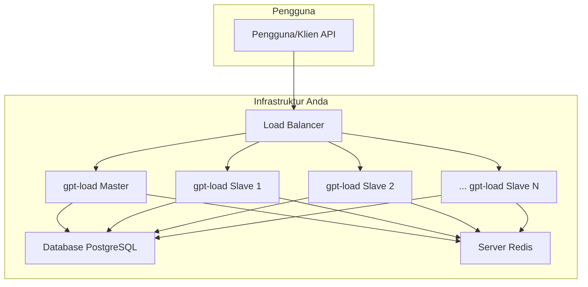

# Panduan Praktis Scaling `gpt-load`

Dokumen ini menjelaskan cara melakukan scale up pada aplikasi `gpt-load` dari satu server menjadi arsitektur multi-server (kluster) untuk menangani beban pengguna yang tinggi.

## Konsep Scaling: Arsitektur Master-Slave

Kunci untuk scaling `gpt-load` adalah arsitektur **Master-Slave** yang sudah dirancang di dalam aplikasi.

*   **Shared Database & Cache:** Semua instance `gpt-load` (baik master maupun slave) harus terhubung ke **satu database PostgreSQL dan satu server Redis yang sama**. Ini adalah syarat mutlak, karena Redis digunakan untuk sinkronisasi state (seperti daftar API key yang aktif) antar server.
*   **Master Node (1 buah):** Bertugas untuk pekerjaan "administratif" seperti migrasi database, inisialisasi pengaturan, dan menjalankan tugas terjadwal (seperti validasi kunci API dan pembersihan log). Node ini juga tetap melayani traffic proxy.
*   **Slave Nodes (Banyak):** Ini adalah "pekerja" utama. Mereka tidak menjalankan tugas administratif, hanya fokus melayani traffic proxy. Anda bisa menambahkan node slave sebanyak yang Anda butuhkan untuk menangani beban.
*   **Load Balancer:** Komponen ini berada di depan semua node `gpt-load`. Semua traffic dari pengguna akan masuk ke Load Balancer terlebih dahulu, yang kemudian akan mendistribusikan permintaan secara merata ke semua node (master dan slave).

## Diagram Arsitektur Scaling



## Langkah-langkah Scale Up

**Asumsi:** Anda sudah memiliki server PostgreSQL dan Redis yang berjalan dan dapat diakses melalui jaringan oleh semua server tempat Anda akan menjalankan `gpt-load`.

### Langkah 1: Siapkan Konfigurasi `.env` untuk Master Node

Buat file `.env` untuk server master Anda. Pastikan `DATABASE_DSN` dan `REDIS_DSN` menggunakan alamat IP/hostname yang bisa dijangkau dari server lain, bukan `localhost`.

**Contoh `env.master`:**
```ini
# Server Configuration
PORT=3001
HOST=0.0.0.0
IS_SLAVE=false # atau baris ini bisa dihapus/dikosongkan

# Authentication & Database
# Pastikan AUTH_KEY sama untuk semua node
AUTH_KEY=sk-rahasia-yang-sangat-aman

# Gunakan IP/hostname yang bisa diakses dari node lain
DATABASE_DSN="host=192.168.1.100 user=postgres password=123456 dbname=gpt-load port=5432 sslmode=disable"
REDIS_DSN="redis://192.168.1.101:6379/0"

# Performance
MAX_CONCURRENT_REQUESTS=100
```
Jalankan instance `gpt-load` pertama Anda menggunakan konfigurasi ini. Ini akan menjadi Master Node Anda.

### Langkah 2: Siapkan Konfigurasi `.env` untuk Slave Node

Untuk setiap server tambahan yang ingin Anda jalankan sebagai slave, buat file `.env` yang hampir identik, **tetapi dengan satu perbedaan penting: `IS_SLAVE=true`**.

**Contoh `env.slave`:**
```ini
# Server Configuration
PORT=3001
HOST=0.0.0.0
IS_SLAVE=true # Ini adalah pengaturan kunci untuk node slave

# Authentication & Database
# Pastikan AUTH_KEY sama untuk semua node
AUTH_KEY=sk-rahasia-yang-sangat-aman

# Gunakan DSN yang SAMA PERSIS dengan master
DATABASE_DSN="host=192.168.1.100 user=postgres password=123456 dbname=gpt-load port=5432 sslmode=disable"
REDIS_DSN="redis://192.168.1.101:6379/0"

# Performance
MAX_CONCURRENT_REQUESTS=100
```
Jalankan instance `gpt-load` baru di server-server lain menggunakan konfigurasi slave ini. Anda bisa membuat sebanyak yang Anda butuhkan.

### Langkah 3: Konfigurasi Load Balancer

Siapkan Load Balancer (misalnya Nginx, HAProxy, atau layanan cloud seperti AWS ALB) untuk mendistribusikan traffic ke semua alamat IP dan port dari node `gpt-load` yang telah Anda jalankan (baik master maupun slave).

*   **Backend Servers:**
    *   `http://<IP_MASTER_NODE>:3001`
    *   `http://<IP_SLAVE_NODE_1>:3001`
    *   `http://<IP_SLAVE_NODE_2>:3001`
    *   ...dan seterusnya.
*   **Health Check:** Konfigurasikan Load Balancer untuk memeriksa endpoint `/health` pada setiap node untuk memastikan hanya node yang sehat yang menerima traffic.

### Langkah 4: Arahkan Pengguna ke Load Balancer

Ubah endpoint yang digunakan oleh klien/pengguna Anda dari alamat IP `gpt-load` tunggal menjadi alamat IP atau domain dari Load Balancer Anda.

Dengan arsitektur ini, jika Anda membutuhkan lebih banyak kapasitas, Anda hanya perlu mengulangi **Langkah 2**: jalankan instance `gpt-load` baru dengan konfigurasi `env.slave` dan tambahkan ke daftar server di Load Balancer Anda.